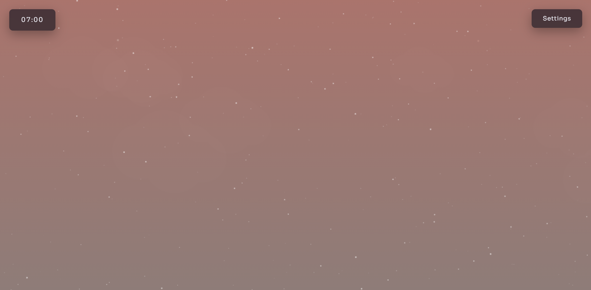
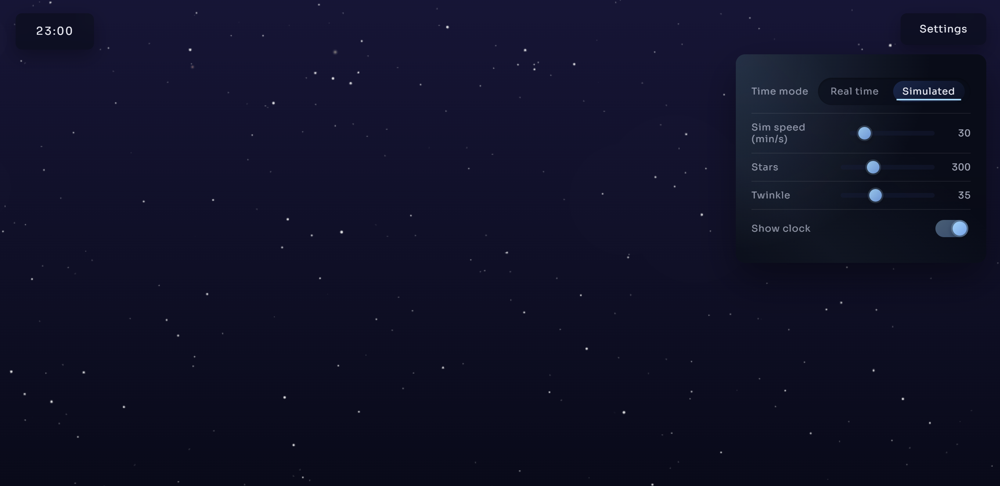

# stratus

**stratus** is a small web project that generates a dynamic sky matched to the current time. stars bloom at night, and a settings menu lets you tweak the speed, star density, and the clock display.

## preview
### Day

### Night

